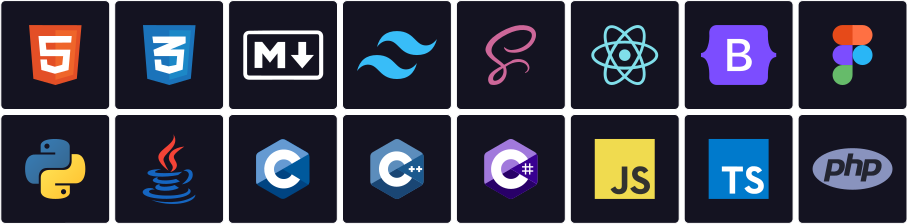

# Hi👋, I'm [Ranit Manik](https://ranitmanik.github.io/Portfolio-1.0/)

<h3>𝑨 𝒑𝒂𝒔𝒔𝒊𝒐𝒏𝒂𝒕𝒆 𝒅𝒆𝒔𝒊𝒈𝒏𝒆𝒓 𝒂𝒏𝒅 𝒅𝒆𝒗𝒆𝒍𝒐𝒑𝒆𝒓 𝒇𝒓𝒐𝒎 𝑰𝒏𝒅𝒊𝒂</h3>

- 🏫 Currently pursuing a Bachelor's degree in Computer Science at [CEMK](https://cemkolaghat.in/).
- 💻 Open Source Contributor with a focus on [GitHub](https://github.com/RanitManik).
- 📚 Proficient in HTML, CSS, JavaScript, Python, Java, C, and Figma.
- 🌐 Visit my [Portfolio](https://github.com/RanitManik/Portfolio-1.0) to explore my projects and achievements.
- 📝 Writing technical blogs on [Hashnode](https://hashnode.com/@ranitmanik).
- 📧 Reach me via [Email](mailto:ranitmanik.dev@gmail.com) or connect on [LinkedIn](https://www.linkedin.com/in/ranit-manik/).
- 📍 Currently based in Mecheda, West Bengal, India.

<h2 align="center">📊 𝗚𝗶𝘁𝗛𝘂𝗯 𝗦𝘁𝗮𝘁𝘀 📊</h2>

<table width="100%">
  <tr>
    <td width="50%">
        <a href="https://github.com/RanitManik">
          <picture>
            <source media="(prefers-color-scheme: dark)" srcset="https://github-readme-stats-sigma-five.vercel.app/api?username=RanitManik&theme=radical&hide_border=false&include_all_commits=true&count_private=true&show_icons=true" />
            <source media="(prefers-color-scheme: light)" srcset="https://github-readme-stats-sigma-five.vercel.app/api?username=RanitManik&hide_border=false&include_all_commits=true&count_private=true&show_icons=true" />
            
          </picture>
        </a>
    </td>
    <td width="50%">
        <a href="https://github.com/RanitManik">
          <picture>
            <source media="(prefers-color-scheme: dark)" srcset="https://github-readme-streak-stats-seven-psi.vercel.app?user=RanitManik&theme=radical" />
            <source media="(prefers-color-scheme: light)" srcset="https://github-readme-streak-stats-seven-psi.vercel.app?user=RanitManik" />
            
          </picture>
        </a>
    </td>
  </tr>
</table>

<h2 align="center">🧑‍💻 𝗟𝗮𝗻𝗴𝘂𝗮𝗴𝗲 𝗦𝘁𝗮𝘁𝘀 🧑‍💻</h2>

<table width="100%" align="center">
  </tr>
  <tr>
    <td width="40%"  align="center">
        <a href="https://github.com/RanitManik">
          <picture>
            <source media="(prefers-color-scheme: dark)" srcset="https://github-readme-stats.vercel.app/api/top-langs/?username=RanitManik&layout=compact&theme=radical&langs_count=10" />
            <source media="(prefers-color-scheme: light)" srcset="https://github-readme-stats.vercel.app/api/top-langs/?username=RanitManik&layout=compact&langs_count=10" />
            
          </picture>
        </a>
    </td>
    <td width="60%"  align="center">
        <a href="https://github.com/RanitManik">
          <picture>
            <source media="(prefers-color-scheme: dark)" srcset="https://github-readme-stats.vercel.app/api/wakatime?username=RanitManik&layout=compact&theme=radical&langs_count=10" />
            <source media="(prefers-color-scheme: light)" srcset="https://github-readme-stats.vercel.app/api/wakatime?username=RanitManik&layout=compact&langs_count=10" />
            
          </picture>
        </a>
      </td>
  </tr>
</table>
  
<h2 align="center">🏆 𝗚𝗶𝘁𝗛𝘂𝗯 𝗧𝗿𝗼𝗽𝗵𝗶𝗲𝘀 🏆</h2>

  <picture>
    <source media="(prefers-color-scheme: dark)" srcset="https://github-profile-trophy.vercel.app/?username=RanitManik&theme=radical&no-frame=false&no-bg=false&margin-w=4&row=1" />
    <source media="(prefers-color-scheme: light)" srcset="https://github-profile-trophy.vercel.app/?username=RanitManik&no-frame=false&no-bg=false&margin-w=4&row=1" />
    
  </picture>

<h2 align="center">💻 𝗧𝗲𝗰𝗵 𝗦𝘁𝗮𝗰𝗸 💻</h2>

  <picture>
    <source media="(prefers-color-scheme: dark)" srcset="Assets/skills-svg-dark.svg" />
    <source media="(prefers-color-scheme: light)" srcset="Assets/skills-svg-light.svg" />
    
  </picture>

  
  
  <picture>
    <source media="(prefers-color-scheme: dark)" srcset="https://github.com/RanitManik/ranitmanik/blob/output/github-snake-dark.svg" />
    <source media="(prefers-color-scheme: light)" srcset="https://github.com/RanitManik/ranitmanik/blob/output/github-snake.svg" />
    
  </picture>

